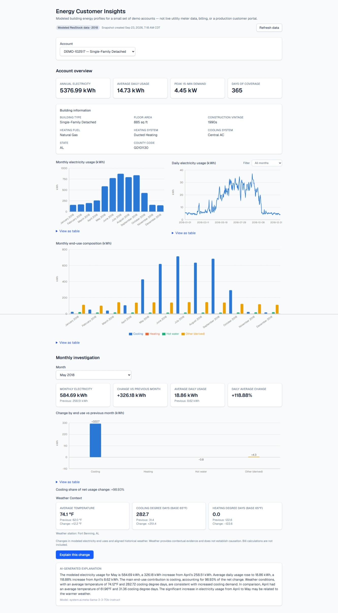
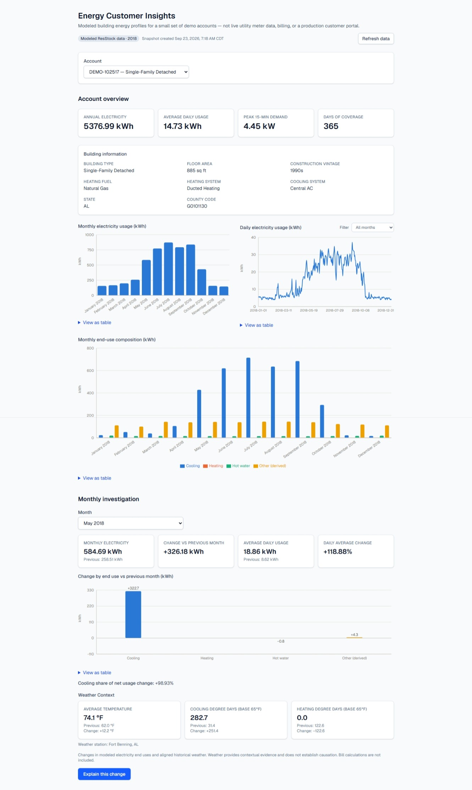
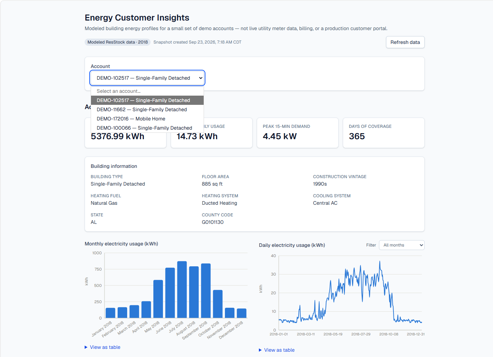

# Energy Customer Insights

An end-to-end AWS + Databricks + AI + React project that turns modeled
building energy data into a customer-facing insights application: raw
15-minute consumption files land in S3, flow through a Databricks medallion
pipeline with automated weather enrichment, and are served through a model
endpoint that pairs deterministic analytics with an LLM-generated,
plain-English explanation — all rendered in a React/TypeScript frontend that
discovers accounts dynamically rather than hardcoding them.

## What this demonstrates

A realistic pattern for shipping an AI-assisted analytics product without
letting the LLM anywhere near the actual math: the pipeline computes every
number (monthly comparisons, end-use breakdowns, degree days), and the model
serving layer hands that already-computed evidence to an LLM whose only job
is to describe it accurately in plain English, with explicit guardrails
against inventing causes. It also demonstrates automated, code-free
onboarding of new source data — see [Validated automation](#validated-automation-adding-a-fourth-building) below.

## Application showcase

**Monthly investigation with AI explanation** — `DEMO-102517`, May 2018.
Electricity usage rose from 258.51 kWh in April to 584.69 kWh in May, a
326.18 kWh increase, with cooling responsible for 322.69 kWh of that change
(98.93% of the net increase). Average temperature rose from 61.96°F to
74.12°F over the same period, and cooling degree days rose from 31.36 to
282.72 — weather context that is **consistent with** greater cooling demand,
not asserted as the cause. The analytics pipeline computes every one of
these numbers; the LLM's only job is to turn that already-computed evidence
into the plain-English paragraph shown at the bottom — it does not calculate
the energy metrics itself.



**Account overview** — annual usage, building information, the monthly
usage pattern, and end-use composition for a selected account.



## Architecture overview

```
AWS source simulator
  → S3 incoming
  → Lambda scheduled transfer
  → S3 landing / archive / audit
  → Databricks Auto Loader
  → Bronze (raw ingestion + audit)
  → Silver (15-minute consumption, automated building onboarding,
            hourly aggregation, weather enrichment)
  → Gold (daily / monthly / usage investigation, dynamic account summary)
  → published serving snapshot (Unity Catalog Volume)
  → Databricks Model Serving (deterministic evidence + AI explanation)
  → React / TypeScript frontend
```

Full write-up, including why adding a building doesn't require redeploying
the model, and exactly how the AI explanation layer works: **[docs/architecture.md](docs/architecture.md)**.

## Technology stack

- **Ingestion:** AWS S3, AWS Lambda
- **Pipeline:** Databricks (Auto Loader, Delta Lake, PySpark), Unity Catalog
- **Serving:** Databricks Model Serving, MLflow (`pyfunc.PythonModel`)
- **AI:** Databricks-hosted Llama 3.3 70B via the AI Gateway, evidence-constrained prompting with a deterministic fallback
- **Frontend:** Next.js (App Router), TypeScript, React, Tailwind CSS, Recharts
- **Testing:** Vitest, React Testing Library

## Automated building onboarding

New building metadata is matched automatically from ResStock reference data
and a supported weather-county mapping — the pipeline fails safely (raises,
doesn't partially onboard) if either is missing, rather than silently
admitting bad data. Gold assigns each building a public account ID
dynamically (`DEMO-<building_id>`), and the frontend obtains the account
list by calling `list_accounts` — the production frontend does not
hardcode the account count or account list. (Test fixtures and the smoke
test intentionally reference specific known demo accounts for verification
purposes; that's separate from the application code path.)

## Validated automation: adding a fourth building

A fourth building's source file was introduced and flowed through the
entire pipeline — S3 transfer, Bronze, automatic Silver onboarding, weather
enrichment, Gold, dynamic account creation, snapshot refresh, live serving
endpoint, frontend discovery — with no manual steps and no frontend changes.
The new account, `DEMO-11662`, appeared in the frontend's account selector
automatically:



The AWS transfer step was confirmed directly against S3 — the landing and
archive copies existed, and the file was gone from incoming, matching the
Lambda's copy-verify-then-delete contract (`aws/README.md`).

| Layer | Count |
|---|---:|
| Bronze | 140,160 |
| Silver 15-minute | 140,160 |
| Silver hourly | 35,040 |
| Silver buildings | 4 |
| Gold daily | 1,460 |
| Gold monthly | 48 |
| Gold investigation | 48 |
| Gold / snapshot / live endpoint accounts | 4 |

Details and how these numbers were checked: **[docs/validation-results.md](docs/validation-results.md)**.

## Repository structure

```
energy-customer-insights/
├── README.md
├── LICENSE                 # MIT — covers this repo's code only, not the NREL dataset
├── aws/                    # Lambda source-transfer implementation
│   └── lambda/energy-consumption-file-transfer/
├── databricks/             # Bronze / Silver / Gold / publish / serving notebooks
│   ├── bronze/
│   ├── silver/
│   ├── gold/
│   ├── publish/
│   ├── serving/            # MLflow model + API logic, credential setup
│   └── validation/         # End-to-end pipeline validation
├── frontend/                # Next.js / TypeScript application
├── docs/                    # Architecture and validation write-ups
└── config/                  # Configuration overview (no real credentials)
```

See `databricks/README.md` for exactly which notebook backs each pipeline
stage, `frontend/README.md` for frontend setup/run/test instructions, and
`config/README.md` for exactly which values you'd need to supply to run
this yourself.

## Data provenance and sources

All application data is derived from **NREL's ResStock 2022 Release, AMY2018
Release 1** dataset, part of the [End-Use Load Profiles for the U.S.
Building Stock](https://www.nrel.gov/buildings/end-use-load-profiles)
project published by the National Renewable Energy Laboratory (NREL) via
the [Open Energy Data Initiative (OEDI)](https://data.openei.org/). This is
modeled building energy simulation output, not real utility customer data —
the application's accounts (`DEMO-<building_id>`) are demo accounts, not
real customers, and the application does not represent a production
customer portal.

**Source data is not included in this repository.** The pipeline expects
the raw ResStock files to be supplied separately into your own S3 bucket
(see `config/README.md`) — none of the underlying dataset is checked into
`databricks/` or anywhere else here.

To retrieve the source dataset yourself:
- NREL project page: <https://www.nrel.gov/buildings/end-use-load-profiles>
- ResStock datasets index: <https://resstock.nrel.gov/datasets>
- AWS Open Data registry entry: <https://registry.opendata.aws/nrel-pds-building-stock/>
  — the 2022 AMY2018 Release 1 files are published under
  `oedi-data-lake/nrel-pds-building-stock/end-use-load-profiles-for-us-building-stock/2022/resstock_amy2018_release_1/`
  (publicly readable via anonymous S3 GET, no AWS account required)

**License scope:** this repository's MIT license (`LICENSE`) covers the
original code in this repository only — the AWS Lambda source, Databricks
notebooks, and frontend application. It does **not** extend to, and does
not govern, the NREL ResStock dataset itself, which NREL/DOE publish
separately under their own terms.

## Limitations

- This is a portfolio/demonstration project, not a production billing or
  customer-service system — it has no per-user authentication, and any
  permitted caller can read all demo accounts.
- Weather is presented as contextual/correlational evidence for the AI
  explanation, never as a proven cause of a usage change.
- The AI explanation can fall back to a deterministic, non-AI summary if the
  LLM call fails; the frontend labels this distinctly rather than presenting
  it as an AI response.
